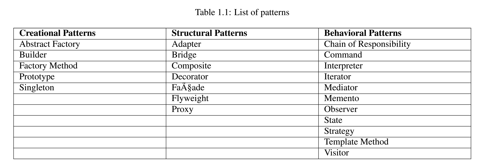

## Java Design Patterns

### Categorization of Patterns
* _From Rohit Joshi's Java Design Patterns : Reusable Solutions to Common Problems_ 

####  Creational Patterns
* 객체의 초기화 과정을 디자인 하기 위해서 사용되는 패턴들. 
* 이 패턴들은 상속을 통해 객체의 생성 과정을 다양하게 만든다. 
* 두 개의 자주 등장하는 테마들 
    1. 시스템에서 어떤 concrete class 를 사용하는가에 대한 정보를 캡슐화한다. 
    2. 이 클래스들의 인스턴스들이 어떻게 생성되고 조립되는지에 대한 과정을 숨긴다. 
* 결과적으로 creational pattern 들은 무엇이 생성되고, 누가 이를 생성하고, 어떻게 이를 생성하고, 
언제 생성되는지에 대한 유연성을 제공한다. 

#### Structural Patterns 
* 더 큰 구조를 구성하기 위해서 클래스와 객체들이 어떻게 작성되는지와 관련된 패턴들이다. 
* 상속을 통해서 인터페이스를 작성하거나 구현한다. 
* 간단한 예로, 다중 상속이 어떻게 두 개 이상의 클래스들을 하나로 합치는지 생각해 보라. 
결과적으로 나오는 클래스는 부모 클래스의 속성들을 물려받은 클래스이다. 
* 이 패턴은 특히 독립적으로 작성된 클래스들의 라이브러리들이 같이 작동하도록 할 때 유용하다. 
* 인터페이스를 작성하거나 혹은 구현을 하는 대신, 이 패턴은 객체들이 새로운 기능을 갖기 위해서 
어떻게 해야 하는지에 대한 방법들을 묘사한다. object composition 에의 유연성은 run-time 에 
composition 을 바꿀 수 있는 능력에서 오는데, 이는 static class composition 에서는 절대로 불가능한 것이다. 

#### Behavior Patterns
* 이 패턴은 객체들 간의 책임 할당과 (객체들 사이의 관계를 묘사한) 알고리즘에 초점을 맞춘다. 
* 객체들 혹은 클래스들의 패턴을 묘사할 뿐만 아니라 그들 사이의 소통의 패턴 또한 묘사한다. 
* 이 패턴들은 매우 복잡한 control flow 를 구체화 하는데, 이는 보통 run-time 에 파악하기 어려운 flow 들이다. 
* 복잡한 flow of control 에 집중하는 대신 어떻게 객체들이 상호 연관되어 있는지에 집중하도록 해준다.
* inheritance 대신 object composition 을 많이 사용한다. 
* 객체들간의 관계가 형성되려면 서로가 서로에 대한 참조를 갖고 있어야 하는데 이는 coupling 을 강화시키는 
결과를 초래한다. 극단적으로 모든 객체들이 서로에 관해 알게 될 수 도 있다. 
* Mediator 패턴은 peer 객체들 간에 중개자를 소개함으로써 이 문제점을 해소한다. 이로써 loose coupling 을 달성할 수 있다.

 

### (1) Vaskaran Sarcar's Java Design Patterns  
From Vaskaran Sarcar's book ***Java Design Patterns : A Tour with 
23 Gang of Design Patterns in Java***

* [Ch2. Observer Pattern](./src/observer)
    * 예시 코드 : [Observer Pattern Practice](./src/observer/ObserverPatternPractice.java)
    * Java 의 내장 Observable 클래스의 상속, Observer 인터페이스의 구현을 통해 연습해 보았다. 
    * 고객에게 Trending Movie의 정보를 업데이트 받도록 MovieObservable을 subscribe 하도록 하고,
    MovieInfo 가 업데이트 될 때 마다 업데이트 내역을 보여주는 프로그램이다.    

* Ch3. Singleton Pattern 

* [Ch4. Proxy Pattern](./src/proxy)
    * [Proxy Pattern 설명](./src/proxy/proxy-pattern.md)
    * 핵심 : 실제 객체의 (Concrete Object) 생성 비용이 높을 때 Proxy(대리인) 를 두어서 
    객체를 필요할 때만 생성하도록 하고, 객체의 메서드 또한 대리인을 통해 호출하는 방식이다. 
    한 클래스를 다른 클래스에 대한 인터페이스로서 사용하고자 할 때 사용하는 방법이다. 
    * 프록시에는 다양한 종류가 있다. (Virtual Proxy, Smart Reference, Remote Proxy, Protection Proxy ...)  

* [Ch5. Decorator Pattern](./src/decorator)
    * [Decorator Pattern 설명](./src/decorator/decorator-pattern.md)
    * 핵심 : 상속 기법을 사용하지 않고 객체의 기능을 확장하고 싶을 때 객체에 새로운 
    기능을 부여할 수 있는 Decorator 를 사용한다.
    
* **Ch6. Template Method Pattern**
  * 게임 회사에서 다양한 게임들을 개발하고 있다고 하자 ... Game 이라는 상위 추상 클래스를 만들어서 여러 다른 게임 클래스들이 이를 상속받는 식으로 만든다고 하자. 
  * 이걸 Template method pattern 이라고 한다.
    
* [Ch8. Adapter Pattern](./src/adapter)
    * [Adapter Pattern 설명](./src/adapter/adapter-pattern.md)
    * 핵심 : 언어가 다른 두 사람이 이야기 할 때 통역사가 필요하듯, 자바에서 서로 다른 
    두 인터페이스가 소통할 경우 adapter 가 필요하다. 
    * Class Adapter : 인터페이스를 구현한 클래스를 상속받아서 `super.Imethod()` 의 기능을 
    수정하는 방식으로 작동한다. 
    * Object Adapter : 인터페이스를 구현한 클래스의 객체를 생성자로 받아서 `this.IObj.Imethod()`의 
    기능을 수정하는 방식으로 작동한다. 
    
* **Ch11. Facade(파사드) Pattern**
  * 퍼사드(프랑스어: façade[fəˈsɑːd] 영어: facade) 패턴(외관 패턴)은 소프트웨어 공학 디자인 패턴 중 하나이다. 객체 지향 프로그래밍 분야에서 자주 쓰인다. Facade (외관)는 "건물의 정면"을 의미한다.
  * Computer 는 여러가지 다양한 서브 시스템으로 이루어져 있다. 
  * Cpu, hard drive, memory, monitor, mouse ... 
  * 컴퓨터는 아주 복잡한 시스템이기 때문에 여러가지 컴포넌트들을 모아서 만들어야 한다. 
  * 이 때 각 컴포넌트들을 별개로 만들면 ... 상황이 복잡해진다. 이런 경우 파사드 디자인 패턴을 사용할 수 있다. 
  * 한 우산 아래에 여러 컴포넌트들을 만들어 놓고, 클라이언트가 파사드라는 미들맨을 통해서 각 컴포넌트에 접근할 수 있도록 한다. 
  * Provides a unified interface to a set of interfaces in a subsystem. Facade defines a higher-level interface that makes the subsystem easier to use. 
    
* [Ch14. State Pattern](./src/state)
    * [State Pattern 설명](./src/state/state-pattern.md)
    * 핵심 : 네트워크의 연결 상태처럼 state 가 변화하는 경우 이 패턴을 사용한다. 
    * TV가 on off 된 상태를 표현하는 구현이 예제임. 
    * 주의 : state 가 많아질수록 system 을 유지하기 힘들어 질 수 있음. 
    
* [Ch15. Builder Pattern](./src/builder)
    * [Builder Pattern 설명](./src/builder/builder-pattern.md)
    * 핵심 : 객체의 조립 과정과 최종적인 객체의 생성을 분리시킬 때 사용한다. 
    * 포괄적으로 "차량" 제품을 만든다고 할 때, 어떤 차량을 만들지는 클라이언트가 정한다. 
    예를들어 자동차를 만들 수 도 있고, 오토바이를 만들수 도 있다. 자동차든 오토바이든 이들을 
    조립할 때 공통적으로 들어가는 요소들이 있다. 차량의 몸체, 바퀴, 헤드라이트 등은 개수와 형태만
    다를 뿐 들어가긴 들어간다. 따라서 포괄적으로 "차량의 생산"을 담당하는 인터페이스를 만들고 
    이들을 Building 하는 과정은 각기 다른 CarBuilder, MotorCycleBuilder 등 에서 담당한다. 
    * 단점 : 코드의 중복이 많다. Mutable Object 를 원할 경우 이 패턴을 사용해서는 안된다. 객체를 
    생성한 후 수정하는 것이 불가능 - 혹은 불편 - 하기 때문이다.
    
* [Ch16. Flyweight Pattern](./src/flyweight)
    * [Flyweight Pattern 설명](./src/flyweight/flyweight-pattern.md)
    * 핵심 : 생성할 객체들이 비슷한 경우 약간씩의 Customizing 만 해주면 된다. 
    이 때 Factory 를 통해 객체를 생성하고, 외부에서 객체의 다른 속성들을 customizing 해준다.

* Ch18. Mediator Pattern 

* [Ch21. Composite Pattern](./src/composite)
    * [Composite Pattern 설명](./src/composite/composite-patterns.md)
    * 핵심 : 객체들간의 상-하 관계를 구조화 하고 싶을 때 사용되는 패턴이다. 
    계층에 속한 요소들을 동적으로 추가, 삭제할 수 있다. 
    
### (2) Java 언어로 배우는 디자인 패턴 입문 (멀티쓰레드 편) 
* [Table of Contents (TXT File)](./src/multithread/table-of-contents.txt)

0. [Introduction](src/multithread/notes/0-java-threads.md)
    * 요약 : Java 의 Thread 패키지, Concurrent 패키지에 대해서 알아본다. 스레드의 기본 개념 및 생명 주기에 대해 알아본다. 
    멀티스레드 프로그램의 평가 요소에 대해서 알아본다. 
    
1. [Single Threaded Execution Pattern](src/multithread/singlethreadexecution/single-threaded-execution.md)
    * 요약 : 멀티 쓰레디드 프로그래밍의 어려움을 알아본다. 자바의 synchronized 키워드에 대해서 구체적으로 이해한다. 
    데드락이 발생하는 조건과 실제 데드락이 발생하는 코드를 수정하는 방법을 알아본다. 
    * **핵심 : 인스턴스의 상태를 변경/참조하는 부분에 Critical Section 을 설계하고 거기에 항상 한 개의 
    스레드만 통과할 수 있도록 하는 것.**
    
2. [Immutable - 망가뜨리고 싶어도 망가지지 않는다](src/multithread/immutable/immutable.md)
    * 핵심 : 인스턴스가 생성된 후에는 상태가 절대 변하지 않는 클래스. 그 클래스의 메서드에는 
    복수의 메서드가 동시에 액세스 해도 무방하다. 메서드를 synchronized 할 필요 없다. 
    * 적용 상황 
        * 상태의 변화가 없는 경우 
        * 공유 / 빈번한 액세스 있는 경우 
    * 클래스 하나에 mutable, immutable 한 것이 섞여 있는 경우 이를 두 개로 나누어 보자. 
    이 둘을 상호 변환이 가능하도록 만들어 보자. 
        * 예시 : String, StringBuffer 클래스. String 은 immutable 하고, StringBuffer 는 mutable 하다. 
        한편 String 에는 StringBuffer 를 인수로 받는 생성자가 있고, StringBuffer 도 String 을 인자로 받는
        생성자가 있다. SB와 S는 서로 상호 변환이 가능하다. 

3. [Guarded Suspension - 준비가 될 때까지 기다려 주세요](src/multithread/guardedsuspension/guarded-suspension-pattern.md)
    * 핵심 : 가드 조건이 충족될 때 까지 기다렸다가, 조건이 충족되면 요청된 처리를 한다. 
    * 주로 while (가드 조건의 논리부정) { wait() } 을 하고, 깨우는 쪽에서 notifyAll() 을 호출하는 식이다. 

---

# 오라일리 출판 강의 

### Strategy Pattern

- ScoreBoard 
  - calculateScore() 
  - showScore() 
    - Balloon 
      - calculateScore() 
    - Clown
      - calculateScore()
    - SquareBalloon 
      - calculateScore()

- naive approach : 각 클래스에서 다른 방법으로 calculateScore 해야 하므로 상속을 받아서 override 하여 구현한다.

- 문제점 : 상속 받은 클래스 중 하나가 다른 child class 들과는 다른 메소드를 사용해야 할때 ... (변경해야 할 지점이 많아진다. not good.)

- Strategy Pattern 을 사용하면 각 객체에 타게팅 된 계산을 할 수 있다. 

#### Payment system example (Strategy)