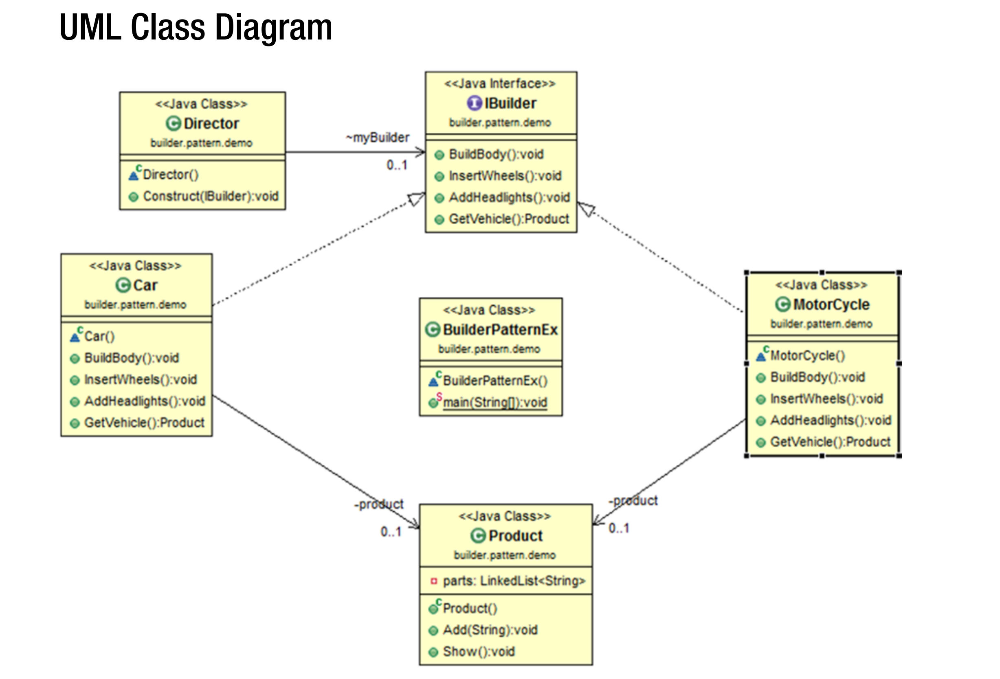

## Builder Patterns 
GoF의 정의 : 복잡한 객체의 Construction 을 그것의 representation 과 분리함으로써 
같은 Construction Process 로 다른 Representation 을 만들 수 있도록 하는 것. 

### Concept 
The pattern is useful when a creational algorithm of a complex object is 
independent of the assembly of the parts of the object. The construction 
process is also capable of building a different representation of that object 
under consideration. 
  
객체를 생성할 때는 객체의 특성을 정의해야 한다. 객체의 생성시 객체의 특성을 정의하는 행위가
온전한 하나의 객체의 "생성"과 분리되어야 하는 경우 이 패턴을 사용한다. 

### Real Life Example
컴퓨터 하나를 만들기 위해서는 고객의 주문에 따라 다른 부품들이 조립된다. 

### Computer World Example
우리는 종종 하나의 텍스트 포맷을 다른 텍스트 포맷으로 변환하여야 한다. (e.g. RTF to ASCII text)

### Illustration 
IBuilder, Car, MotorCycle, Product, Director 클래스가 있다. Car, MotorCycle 은 
IBuilder 인터페이스를 구현한다. IBuilder 는 제품의 부분 부분을 생성할 때 사용된다. 
제품은 "Complex object under construction"을 대표한다. 이 조립 과정은 Product 
클래스에서 묘사된다. 이 조립 과정을 나타내기 위해 LinkedList 자료구조를 사용한다. 
  
Car 과 MotorCycle 은 "concrete implementation"이다. 이들은 IBuilder 인터페이스를
구현하였다. 이것이 우리가 BuildBody(), InsertWheels(), AddHeadLights(), GetVehicle()
과 같은 메서드가 필요한 이유이다. 우리는 첫 세 개의 메서드를 이용해서 차량의 몸체를 
만들것이고, 바퀴를 넣을 것이며 차량에 헤드라이트를 넣을 것이다. GetVehicle() 은 최종적인
생산 제품을 리턴할 것이다. 마지막으로 Director 클래스는 최종적인 차량을 생산하는 것을 
담당한다. Director 는 IBuilder 인테페이스를 사용해 제품을 만들것이다. 동일한 Construct()
메서드를 호출해 다른 종류의 차량을 만들어낸다. 

### UML Diagram 

### Note 
1. 여기서 우리는 조립하는 코드를 그것의 representation 과 분리시킨다. 따라서 복잡한 
Construction process 를 감추고, 간단한 절차로 객체를 represent 한다. 
2. 여기서 우리는 "어떻게 제품이 만들어 지는지"에 초점을 맞춘다. 
3. 일반적으로, 우리는 생성이 완료된 객체를 리턴하는 메서드를 하나만 둔다. 다른 메서드들은 
오직 creation process 를 담당하도록 한다. 
4. Builder Pattern 에서는 약간의 code duplication 이 필요하다. - 이 패턴의 단점이기도 하다. 
5. 또한, 만약 우리가 mutable object 를 원한다면 (생성이 완료된 후 변경되어야 하는 객체)
우리는 이 패턴을 사용해서는 안된다. 

