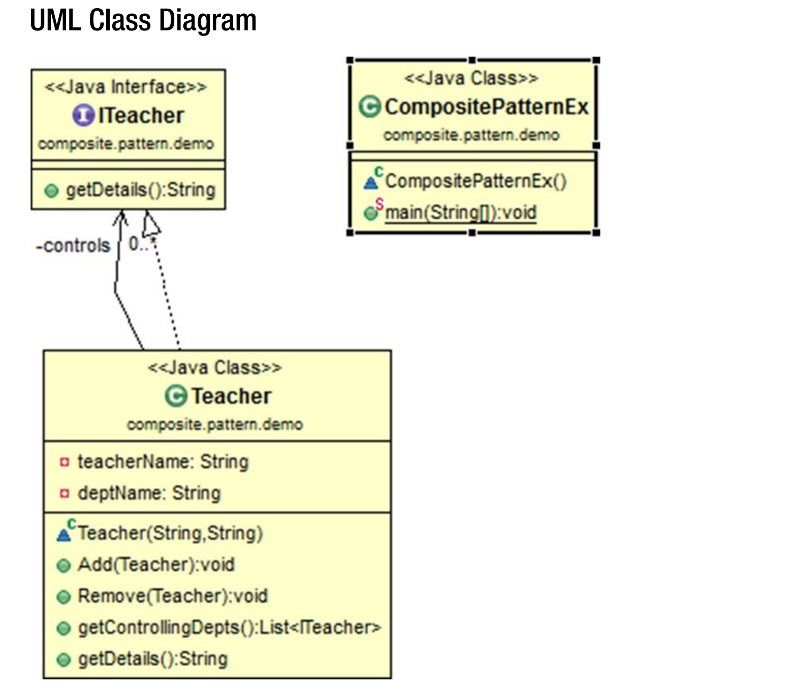

## Composite Patterns 

GoF 의 정의 : 부분 - 전체 계층 구조를 표현하기 위해 객체를 트리 구조로 작성한다. 
컴포짓 패턴은 클라이언트가 개별적인 객체들을 통일성 있게 작성하도록 한다. 

### Concept 
이 패턴은 객체들 간의 부분 - 전체 계층구조를 보일 수 있도록 한다. (part- whole hierarchy)
클라이언트는 composite obejct 를 마치 하나의 객체이 것 처럼 다룰 수 있다. 
객체지향 프로그래밍에서 비슷한 기능을 가진 많은 객체들이 있을 때 composite object 를 만든다. 
이 관계는 객체들 간의 "has-a" 관계로 일컫어지기도 한다. 

### Real-Life Example 
많은 부서들이 있고, 각 부서들 안에 많은 직원들이 있는 조직을 생각해보자. 
모든 직원들은 하나의 조직에 속해있다. 직원들을 부서로 Grouping 하는 것이고, 
이 부서들은 최종적으로 전체의 조직을 구성한다. 

### Computer World Example 
컴퓨터 과학에서 배우는 어떠한 트리 구조는 이와 비슷한 개념을 따른다. 

### Illustration 
이 예제에서는 대학을 예시로 든다. 대학에는 교장과 두 명의 학장이 있다- 한 명은 컴퓨터학부, 한 명은 수학과이다. 
현재 수학과에서는 두 명의 강사가 있다. 컴퓨터 학과에서는 세 명의 강사가 있다. 
컴퓨터 학과의 한 명의 강사가 은퇴한다고 하자. 우리는 이 시나리오를 아래와 같은 단순한 예제로 나타내었다.

### UML Diagram 
 


### Output 

```
*** Composite Pattern Demo ***

 The college has following structure 

Dr.Som is the Principal
	 Mr.Sarcar is the Hod-ComputerSc
	 Mrs.Das is the Hod-Math
		Math Teacher 1 is the MathsTeacher
		Math Teacher 2 is the MathsTeacher
		CSE Teacher-1 is the CSETeacher
		CSE Teacher-2 is the CSETeacher
		CSE Teacher-3 is the CSETeacher

 After CSE Teacher-2 leaving the organization - CSE has following employees : 
		CSE Teacher-1 is the CSETeacher
		CSE Teacher-3 is the CSETeacher
```

### Note 
1. 이 패턴은 객체들 간의 part-whole hierarchy 를 나타내기에 적합하다. 
2. 여기서 클라이언트는 composition of objects 를 마치 하나의 객체인 것 처럼 다룰 수 있다. 
3. 클라이언트들은 새로운 타입의 컴포넌트를 쉽게 추가할 수 있다. 
4. 만약 child ordering 을 다루도록 강요되는 상황이라면 (e.g. parse trees as components)
우리는 그 순서를 유지하기 위해 특별한 조치를 취해야 한다. 
<br/><br/>

**What is the best data structure to store components?** 
<br/>
보편적인 규칙은 없다. 어떠한 요구사항이 주어지느냐에 따라 달라진다. (예를들어, 효율성 등). 
링크드 리스트, 트리, 배열 등 필요에 따라 선택하면 된다. GoF 는 어떠한 general-purpose 
자료 구조를 사용하는게 의무가 아니라는 점을 강조한다.  