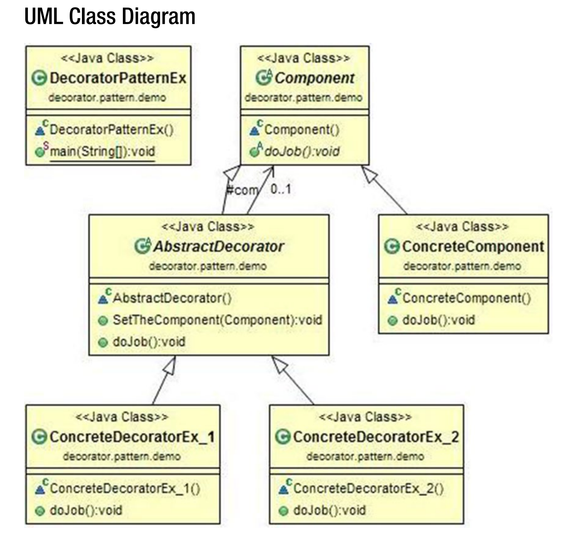

## Decorator Patterns 
GoF 의 정의 : 동적으로 객체에 추가적인 책임을 지도록 하는 것. 데코레이터는 기능 확장을
위해서 subclassing 하는 것에 대한 유연한 해결책을 제공한다. 

### Concept 
이 패턴의 주요 원칙에 따르면 우리는 이미 존재하는 기능들을 수정할 수 는 없지만 이 기능
들을 확장할 수는 있다. 다른말로, 이 패턴은 확장에는 열려있지만 수정에는 닫혀져 있다. (
Open for extension but closed for modification) 클래스 전체에 특정한 기능을 추가하는
대신 특정한 객체에 기능을 추가하고 싶을 때 이 패턴을 사용한다. 

### Real-Life Example 
당신이 집을 소유한다고 가정하자. 당신은 추가적으로 바닥을 더하고자 결정했다. 당연히 
당신은 이미 존재하는 바닥의 설계를 바꾸고 싶지는 않을 것이다. 달신은 새로 추가되는 
바닥에 한해서만 디자인을 바꾸고 싶을 것이고, 이것이 기존의 바닥에 영향을 미치지 않도록 
하고 싶을 것이다. 

### Computer World Example 
GUI 기반의 툴킷에서 border 속성을 더하고 싶다고 가정하자. 보통은 상속을 통해서 하는 
작업이다. 하지만 상속이 최선의 선택이라고 할 수 는 없는데, 왜냐하면 우리의 유저 혹은 
클라이언트들은 이렇게 만들어진 속성에 대해 완전한 컨트롤이 없기 때문이다. 
<br/><br/>
데코레이터는 좀 더 유연한 접근법을 제공해준다 : 위의 경우 우리는 해당 컴포넌트를 다른 
객체에 감쌀(surround) 수 있다. 이러한 enclosing object 는 "decorator"라고 불리운다. 
이 객체는 자신이 꾸미는 컴포넌트의 인터페이스를 따른다(conform). 데코레이터는 요청을 
컴포넌트에게 전달해준다. 이는 요청을 전달하기 전,후로 다른 추가적인 연산들을 수행할 
수 있다. 이 개념을 통해서 무제한의 책임이 추가될 수 있다. 

### UML Diagram 



### ⁉ Decorator Pattern 예시 설명 ⁉
* `ConcreteComponent`는 우리가 최초로 작성하는 클래스를 나타낸다. 
이 클래스를 통해 다양한 객체를 찍어낼 것인데, 직접적으로 `ConcreteComponent`클래스를
상속받아서 객체를 만드는 것이 아니라 중간에 `abstract class AbstractDecorator` 를 추가해서 
해당 추상 클래스가 `ConcreteComponent`가 상속받았던 `Component`라는 Abstract 클래스를 
상속하도록 한다. 이 데코레이터 클래스에는 컴포넌트 객체를 넣어서 초기화 한 후, 
컴포넌트의 기능인 `doJob()`메서드를 실행시킬 수 있는 메서드가 오버라이드 되어있다.
* 최초로 작성한 ConcreteComponent 클래스로부터 상속받아 
ConcreteDecoratorEx_1 과 같은 클래스를 만드는 것이 아니라, AbstractDecorator 
를 상속받아서 클래스를 작성한다. 그러면 원래의 객체가 갖던 doJob()메서드를 `super.doJob()`
을 통해 실행할 수 있고, 새롭게 오버라이드된 `doJob()`메서드에다가 더 다양한 기능을 
추가할 수 있다.
* 뿐만 아니라 Ex_2 라는 객체를 만들어서 Ex_1 으로부터 또 다시 기능을 확장할 수 있다. 


### Output
```
*** Decorator Pattern Demo ***
I am concrete component. I am closed for modification
I am explicitly from Ex_1
I am concrete component. I am closed for modification
I am explicitly from Ex_1
I am explicitly from Ex_2
END Ex_2
```

### Note 
**Decorator Pattern 을 사용했을 때 얻는 이점은 ?** 
<br/>
1. 존재하는 객체들을 방해하지 않고 어떤 특정한 객체에 새로운 기능을 넣을 수 있다. 
2. 우리는 증진적으로(incrementally) 코드를 작성할 수 있다. 예를 들어 간단한 클래스를 
먼저 만들고, 하나 씩 필요할 때마다 데코레이터 객체들을 추가할 수 있다. 결과적으로 
시작부터 각각의 시나리오에 대해 대응할 필요가 없어진다. 아주 복잡한 클래스를 처음에 
만들어 두고 이 클래스로부터 기능을 확장하는 것은 더욱 더 복잡한 작업이라는 것을 기억하자. 
<br/><br/>

**이 패턴은 상속과 어떻게 다른가?** 
<br/>
데코레이터를 그저 붙이거나 떼어냄으로서 한 객체의 책임을 추가, 삭제할 수 있다. 하지만
상속 기법만을 사용한다고 할 때 만약 새로운 책임을 추가하고자 한다면 이 때 마다 새로운
클래스를 만들어내야 한다. 따라서 시스템 안에 여러개의 클래스가 있을 것이고 이로서 시스템은
더욱 더 복잡해질 것이다. 
<br/><br/>

**이 패턴의 가장 큰 단점은 무엇인가?**
<br/>
우리가 충분히 조심하기만 한다면 아주 큰 단점은 없다. 하지만 시스템 안에 너무 많은 
데코레이터가 있다면 시스템을 디버깅하기 어려워질 것이다. 동시에 데코레이터들은 
불필요한 혼란을 초래할 수 있다. 


