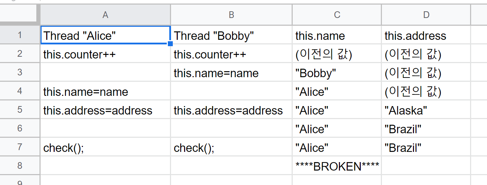
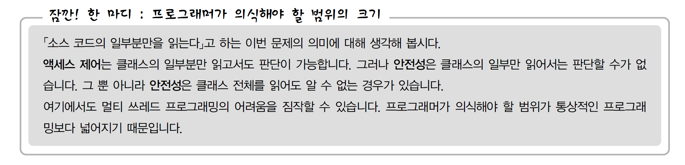

## Single Threaded Execution 
* 예제 코드 : 
    * [MainEx1.java](./MainEx1.java)
    * [Gate.java](./Gate.java)
    * [UserThread.java](./UserThread.java)
    
* UserThread 객체에 Gate 인스턴스를 넘겨주어 Gate 를 통과하는 메서드인 pass() 를 실행시킨다. 

## 학습 정리 
### 테스트로 안전성을 증명할 수 없다.
```
*** Testing Gate. ***
Alice BEGIN
Bobby BEGIN
****BROKEN**** Gate{counter=415, name='Alice', address='Alaska'}
****BROKEN**** Gate{counter=571, name='Bobby', address='Brazil'}
****BROKEN**** Gate{counter=929, name='Bobby', address='Brazil'}
****BROKEN**** Gate{counter=1176, name='Bobby', address='Brazil'}
****BROKEN**** Gate{counter=1388, name='Alice', address='Alaska'}
****BROKEN**** Gate{counter=1601, name='Bobby', address='Brazil'}
****BROKEN**** Gate{counter=1740, name='Alice', address='Alaska'}
Chris BEGIN
****BROKEN**** Gate{counter=2012, name='Alice', address='Alaska'}
```
* 위와같이 오류가 처음 검출될 때 까지 카운터 값은 415번 증가했어야 했다. 
몇 차례, 수십 차례의 테스트 만으로는 오류가 검출되지 않았을 것이다. 
* **동작 테스트로 안전성을 증명할 수 없다! 멀티 스레드 프로그래밍의 어려움.**

### 디버그 표시도 믿을 수 없다. 
```
****BROKEN**** Gate{counter=929, name='Bobby', address='Brazil'}
****BROKEN**** Gate{counter=1176, name='Bobby', address='Brazil'}
```
* 분명 check 메서드에서 작성한 대로 이름과 주소의 첫 글자가 일치하는 데도 브로큰 표시가 뜬다. 
이는 어떠한 쓰레드가 check 메서드를 실행하던 중 다른 쓰레드가 잇따라 pass 메서드를 실행하고 
name 이나 address 의 필드를 바꾸었기 때문이다. 
* **디버그를 표시하는 코드 자체가 쓰레드 세이프가 아니면 잘못된 디버그 표시를 할 수 있기 때문.**

### 소스 리뷰는 안전성을 확보하는 가장 효과적인 방법이다. 



* 위와 같이 코드의 어느 단계에서 쓰레드가 꼬였는지 조사해보는 것이 소스 리뷰이다.
* 시간은 위에서 아래로 흐른다. 

### 주의 
* 보통 쓰레드는 동작할 때 다른 쓰레드를 고려하지 않는다. 
* 쓰레드 Alice 와 Bobby 는 서로가 뭘 하고 있는 지 모름. 
* 두 개 이상의 쓰레드가 공유하고 있는 인스턴스의 필드를 수정하여 문제 발생. 
 

## 연습문제 

### 문제 1-1 (에러가 쉽게 검출될 수 있으려면)
* Counter 값이 커지기 전에 에러를 검출할 수 있도록 Gate 클래스를 수정하라. 
* Critical Section 을 길게 만들면 에러 검출 가능성을 높일 수 있다. 

```
  public void pass(String name, String address){
        this.counter++;
        this.name = name;
        try{
            Thread.sleep(1000);
        }catch (InterruptedException e){
            e.printStackTrace();
            System.out.println("***CRITICAL SECTION***");
        }
        this.address = address;
        check();
    }
```

* 결과 : 

```
*** Testing Gate. ***
Alice BEGIN
Bobby BEGIN
Chris BEGIN
****BROKEN**** Gate{counter=4, name='Bobby', address='Brazil'}
****BROKEN**** Gate{counter=4, name='Bobby', address='Brazil'}
****BROKEN**** Gate{counter=8, name='Chris', address='Brazil'}
****BROKEN**** Gate{counter=8, name='Chris', address='Alaska'}
```

* `Thread.yield` : 크리티컬 섹션 안에서 Thread 클래스의 yield 메소드를 
호출하여 쓰레드의 변환을 재촉하는 방법도 있음. 

### 문제 1-2 (private 필드의 역할)
* Gate 인스턴스의 필드를 수정할 수 있는 메서드는 pass() 임을 보장해준다. 
* protected 를 사용하는 경우 : 필드는 그 클래스의 서브 클래스나 같은 패키지 
안의 클래스에서도 액세스 할 수 있다. 따라서 안전성을 확인하려면 서브 클래스나 
같은 패키지 안의 클래스 까지도 체크해야 한다. 
<br/> 
**위키독스 참고** : 
접근제어자가 `protected`로 설정되었다면 `protected`가 붙은 변수, 메소드는 동일
패키지내의 클래스 또는 해당 클래스를 상속받은 외부 패키지의 클래스에서 접근이 가능하다.
<br/>

* public 을 사용하는 경우 어느 클래스 에서든간에 Gate 클래스 내부의 필드들을 
수정할 수 있게 되므로 Thread Safety 를 얻을 수 없을 뿐만 아니라 코드가 더 
복잡해 지는 경우 예상 치 못한 부수 효과가 있을 수 도 있다.

### 문제 1-3 (synchronized 의 이유)
* toString() 메서드까지 `synchronized` 키워드를 붙인 이유? :  
toString() 은 필드의 값들을 출력하는 메서드인데, 출력하는 필드들이 
공유자원이기 때문에 Guard 가 필요하다. Guard 인 synchronized 키워드를 사용함으로써 
출력하는 도중 필드의 값이 변경되는 것을 방지할 수 있다.
* **일반적으로 복수의 쓰레드에서 공유하는 필드는 synchronized 혹은 volatile 로 보호해야 한다.**

### 문제 1-4 (중간까지 읽은 소스 코드)
 1. O / final class 로 선언되어 있으므로 
 2. O / private int x 로 선언되어 있으므로 
 3. O / move() 메서드가 synchronized 키워드로 선언되어 있으므로 
 4. X / move() 메서드는 안전하지만, 이외의 다른 메서드에서 필드 값을 수정할 수 있으므로 
 안전하다고 단언할 수 없다.   
 5. X / 공유 자원을 취하는 쓰레드가 여러개인 경우 데드락이 발생하므로 
 Point 클래스만 봐서는 데드락이 발생하는 여부를 판단할 수 없다. 
    * 해설 : Point 클래스를 이용하는 다른 클래스의 기능에 따라 데드락은 
    발생하기도 하고 발생하지 않기도 한다. 



### 문제 1-5 (안전성의 확인)
* 테스트를 위해 수정한 파일들 
    * [SecurityGate.java](./SecurityGate.java)
    * [SecurityGateEx.java](./SecurityGateEx.java)
    * [CrackerThread.java](./CrackerThread.java)

* 결과가 해설과 다른데 ... 왜 getCounter 값이 저렇게 크게 나오는지 잘 모르겠음. 

```
*** Testing SecurityGate *** 
Security Gate is NOT safe!
getCounter() == 100
trial = 0
```

### 문제 1-6 (데드락 회피)
* 아래와 같이 데드락이 일어나는 코드이다. 데드락이 발생하지 않도록 코드를 수정하라.  
```
*** Testing Eater Thread ***
Alice takes up Tool{name='spoon'} (left).
Alice takes up Tool{name='fork'} (right).
Alice is eating now, yum yum ! 
Alice puts down Tool{name='fork'} (right).
Alice puts down Tool{name='spoon'} (left).
Alice takes up Tool{name='spoon'} (left).
Bobby takes up Tool{name='fork'} (left).
```

#### 해설 : 
* 방법 1 : 둘다 똑같은 순서대로 fork - spoon 을 집도록 하는 방법
    * SharedResource 의 역할이 대칭이라고 하는 조건을 지키지 못함.
    * (락을 취하는 순서가 정해져 있지 않다는 조건) 
```
new EaterThread("Alice", spoon, fork).start();
new EaterThread("Bobby", spoon, fork).start();
```
* 방법 2 : Spoon 과 Fork 를 Pair로, 즉 하나의 객체로 만들어서 관리하는 방법
    * 복수의 SharedResource 역할이 있다고 하는 조건을 깬 것.  
```
Pair pair = new Pair(spoon, fork);
new EaterThread("Alice", pair).start(); 
...

//Eater Thread 에서 
public void eat(){
    synchronized(pair){ ... }
}
```