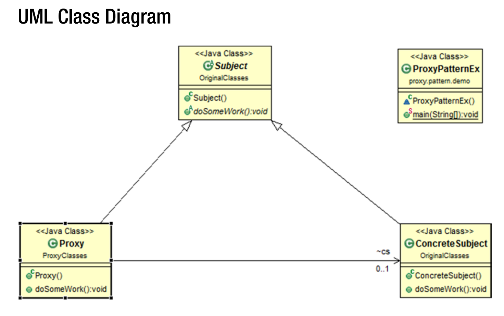

## Proxy Patterns 
GoF 의 정의 : 다른 객체가 한 객체에 대한 접근을 제어할 수 있도록 placeholder 혹은 
surrogate 를 제공하는 것. 

### Concept 
다른 것의 인터페이스로서 작동할 수 있는 클래스를 사용하고 싶다. 

### Real-Life Example 
학교 교실에서 한 학생이 결석한 경우 그 학생의 다른 한 친구가 출석을 부를 때 결석학생의 
목소리를 흉내내어 대리 출석을 할 수 있다. 

### Computer World Example 
은행의 ATM 구현을 생각해보자. 여기서 우리는 여러개의 proxy 객체들을 발견할 수 있다. 
실제 은행의 정보들은 remote server 에 저장되어 있을 것이다. 실제 프로그래밍 
세계에서는 복잡한 객체 (heavy object)를 여러 개 생성하는 것이 매우 costly 하다는 것을
반드시 기억해야 한다. 이런 경우 여러 개의 proxy 객체들을 생성함으로써(proxy 들은 반드시 
original object 를 참조해야 한다) 실제 객체의 완전한 생성이 꼭 필요할 때만 이루어지도록 
해야한다. 이를 통해 메모리와 creational time 을 줄일 수 있다. 

### Illustration 
예시 프로그램에서 우리는 proxy 객체의 doSomework() 라는 함수를 호출할 것이다.
이 함수는 concrete object 의 doSomework() 함수를 호출한다. 우리는 
결과를 직접적으로 concrete object 를 통해 얻게 된다. 
  
이 예시에서 우리는 다음과 같은 구조를 따랐다. 관련된 부분들은 가독성을 높이기 위해 
별도의 패키지로 분리되었다. 우리의 Concrete 혹은 Original 구현들은 `OriginalClasses`라는 
패키지 안에 존재하며, Proxy 구현들은 (`Proxy.java`) `ProxyClasses`라는 패키지 안에 있다. 
프록시는 `ProxyPatternEx.java` 파일에서 생성, 테스트 한다. 

### UML Diagram 

### Note 
Proxy 의 다른 종류들은 뭐가 있는가? 
 
Mainly we are familiar with the following types :
  
* Remote Proxies : 다른 주소 공간에 있는 실제 객체를 숨긴다. 
* Virtual Proxies : 필요에 따라서 heavy object 를 생성하는 등 최적화 기법을 수행할 
때 사용된다. 
* Protection Proxies : 각기 다른 접근 권한이 있을 때 사용된다. 
* Smart Reference : 객체가 접근되었을 때 추가적인 house keeping work 를 할 수 있다. 
전형적인 연산으로는 실제 객체에 대한 참조의 개수를 헤아리는 것이 있다.   